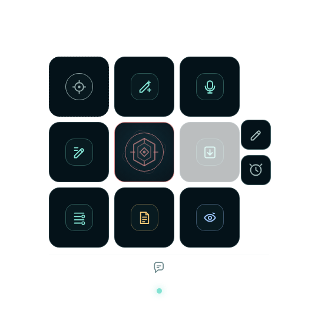

# RadIMO – ReportHalo

RadIMO – ReportHalo is a Windows-only floating companion for radiology reporting. It stays beside the RIS, Word, or another editor and applies short, existing-text-first actions to the active report field. The source application remains authoritative: a foreign field must be explicitly activated, and its identity is checked again before text is written back. Chat is the only verbose surface.

<p align="center">
  
</p>

*Current anonymized closed Orb renderer capture.*

## Mission

Keep the reporting workflow in the window where the report is already being written. ReportHalo provides a quiet 3×3 Orb for dictation, language cleanup, text preparation, assessment, and review. It is a small field tool, not a second desktop application and not a replacement for radiologist judgement.

## Release shape

| Area | Current direction |
| --- | --- |
| UI | Compact, always-on-top Halo Cub by default; closed window 180 × 190 px, with a larger floating Cub option |
| Panels | Attached Text & Chat workspace, Review, Context, and Account panels; panels move with the Orb |
| AI paths | Codex subscription through the official local runtime, or a smaller direct Responses API build for OpenAI/Azure OpenAI |
| Packaging | Windows x64 portable build, per-user installer, API build, and a separate local Field Mapper utility; Codex is not embedded in the app |
| Data boundary | API credentials stay in the Electron main process and use encrypted local storage; direct API conversations use local manual history |
| Status | Unsigned release candidate; not a certified medical device and never the sole basis for a clinical decision |

## The 3×3 Halo Cub

The current German labels are the primary workflow; the icon and tooltip remain available when the Orb is closed.

| Position | Function | What it does |
| --- | --- | --- |
| Top left | **Arbeitsfeld** | Imports explicitly copied text or accepts dropped text. The experimental UIA test can lock an accessible external field; the small X releases it or clears the local source. |
| Top middle | **Ausformulieren** | Makes existing report text clearer without adding unsupported facts. |
| Top right | **Diktat** | Records a short dictation, transcribes it, and keeps the transcript pending until insertion is requested; the normal path copies it for deliberate `Ctrl+V` at the RIS cursor. |
| Middle left | **Lektorat** | Repairs spelling, grammar, punctuation, dictation artifacts, and report style. Medical or logical concerns are reported in Chat, not silently changed. |
| Center | **Agent-Kern** | Shows ready, working, or offline state and is the drag area for moving the Orb. Right-click opens settings, account, per-action prompts, and close. |
| Middle right | **Einsetzen** | Applies a reviewed result to the explicitly activated field after the target is revalidated. |
| Bottom left | **Strukturieren** | Organizes and completes supplied text while preserving measurements, negations, uncertainty, and other report facts. |
| Bottom middle | **Beurteilung ergänzen** | Adds a draft assessment below the existing content; it does not replace the report. |
| Bottom right | **Ergebnis prüfen** | Opens the complete editable result text first; an optional character-level before/after diff, notes, copy, save, and deliberate transfer are available there. |

The right edge opens **Text & Chat** or **Kontext**. The lower edge opens Chat directly. Right-click the center to switch between the compact and larger floating Cub; attached panels keep their native sizes and do not cover the outer controls. Right-click any prompt-bearing button to open its full per-user prompt; the core menu exposes all prompt-bearing functions in one central settings panel. The current workfield is inserted through the `{{TEXT_BLOCK}}` template token, or appended as a delimited block when a custom prompt omits it. Captured external text is automatically discussion context; a proposal created by Chat starts in the local Text pane and never writes to the foreign field by itself.

For RIS context, the **Field Mapper** is an experimental UI Automation diagnostic, not a startup scanner. Normal releases keep UIA disabled: the integrated controls do not start UIA or PowerShell, and the dependable workflow is `mark in DMO/RIS → Ctrl+C → import clipboard`. A developer testing the diagnostic must launch the app with `RADIMO_ENABLE_EXPERIMENTAL_UIA=1` and select the clearly labelled experimental mode for the current session; old preferences never enable it. When enabled, the mapper briefly hides the helper when no target is already selected, lists accessible text controls, matches names, labels, help text, automation IDs, and parent container labels such as `Fragestellung`, `Labor`, `Befund`, or `Beurteilung` with editable wildcard rules, and applies exclusions such as patient identity fields before reading values. Class names alone are not treated as field labels. DMO and custom RIS controls can still expose no stable UIA name or readable value even when dictation works through the cursor. No native window injection or keystroke-replay compatibility path is bundled. Only verified UIA writes are reported as replacements; marked selections are always copied for manual paste instead of being treated as complete fields. If a target accepts a write but cannot be read back, the result stays uncommitted in ReportHalo and is copied for an explicit RIS paste/check. The same experimental mapper is available inside the Context panel and as the API-free `ReportHalo-FieldMapper` diagnostic EXE. It cannot see controls that expose no Windows accessibility tree and may need matching integrity levels when the RIS runs as administrator.

## Safety boundary

Lektorat is conservative. ReportHalo preserves numbers, units, laterality, anatomy, negations, uncertainty, dates, temporal qualifiers, and recommendations. Non-chat actions return a compact result: only `text` can be transferred, while `changes`, unclear points, and possible logical or medical issues stay in Chat. Correction, writing, and structure show the complete replacement text in the local result field. Assessment shows the original text together with a `Beurteilung: …` addendum; transfer appends only that labelled addendum unless the user deliberately edits the original part of the full result. If a user explicitly asks for a reusable correction during Chat, the reply can include the same structured `text` block and metadata; discussion-only replies remain plain. Manual review can be required per action. The RIS or editor remains the authoritative record.

## Run and build

```bash
npm ci
npm run check
npm start                 # Codex subscription path
npm run start:api         # direct OpenAI/Azure OpenAI path
npm run dist:field-mapper # standalone local RIS field inspector
```

For a release check, run `npm run release:gate`. The Codex build reuses an existing official installation or the pinned, checksum-verified installer helper included with the release. `npm run dist:api` creates the smaller API-only package without the Codex source or payload. Release binaries belong in [GitHub Releases](https://github.com/maxrusse/RadIMO-ReportHalo/releases), not in the source tree; the tag workflow publishes the portable Codex build, API-only build, ZIP, and installer as draft assets after verification.

## Links and license

- [Product page](https://maxrusse.github.io/RadIMO-ReportHalo/)
- [UI standard](docs/ui-guidelines.md)
- [End-user license agreement](EULA.txt)
- [Public repository](https://github.com/maxrusse/RadIMO-ReportHalo)

The project uses the proprietary, revocable licensing model used by RadIMO Cortex. `LICENSES/Apache-2.0.txt` applies only to the external Codex notice.
